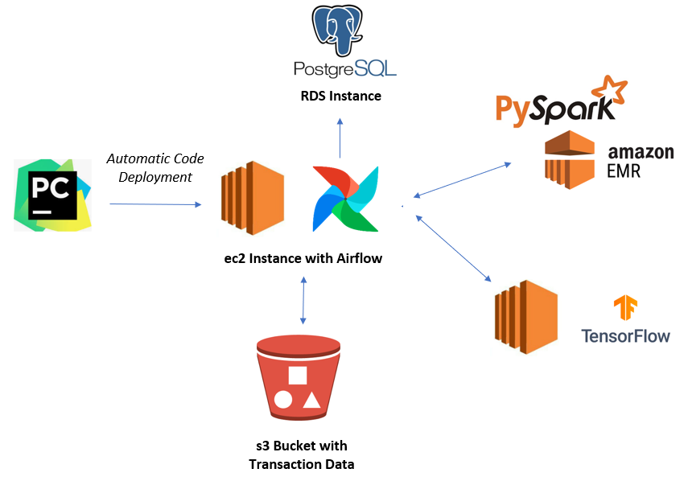
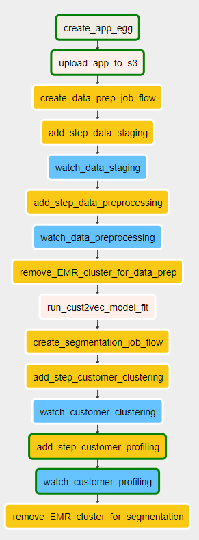
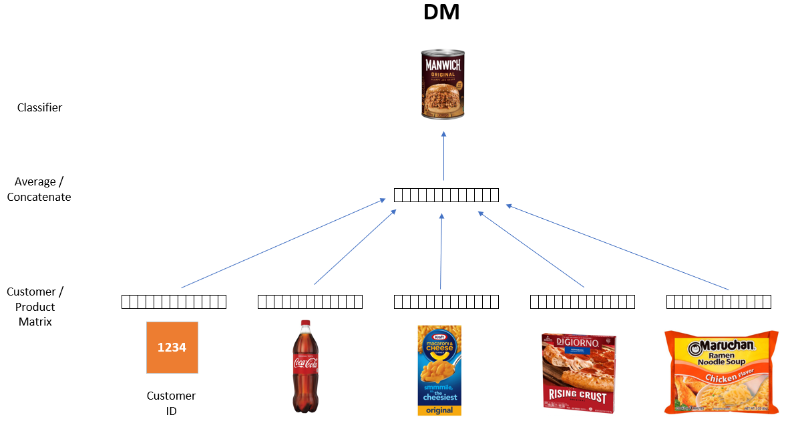
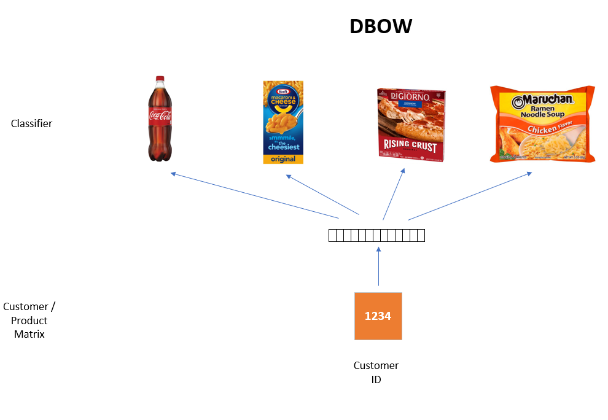
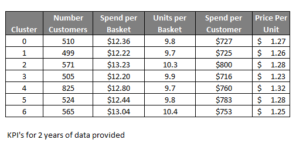

# Creating a customer segmentation with cust2vec

### Project scope

This project contains a pipeline, orchestrated with Airflow, for creating a customer segmentation with cust2vec.

The segmentation is created by first of all generating a customer vector with cust2vec, this takes inspiration 
from NLP and utilizes the doc2vec algorithm replacing document vectors with a customer vector.  The customer vectors 
generated by the algorithm are then clustered using k-means to create groups of customers with similar vectors (and
therefore buying behavior across the store).

The output of the pipeline is a dataset containing the customer vector for each customer and another data set containing the customer segment.

### Data utilized

The data used to create the vectors and segments was provided open source by Dunnhumby, a global leader in 
retail analytics. The dataset contained a sample of 117 weeks of ‘real’ customer data from a large grocery store 
constructed to replicate typical pattern found in in-store data to allow the development of algorithms in a 
(near) real-world environment. The dataset can be downloaded from the following location:

https://www.dunnhumby.com/careers/engineering/sourcefiles

The actual data utilized was from the “Let’s get sort of real” section, specifically the data from a randomly 
selected group of 5,000 customers.

### Infrastructure

The infrastructure utilized in the pipeline is shown in the diagram below:

The decision to utilize Spark was taken as retailer data is typically very large and this use-case requires each 
customer to be 'scored' with a segment.  As the number of transactions typically runs into millions scaleability 
quickly becomes an issue with standard Python libraries.  The cust2vec model was fitted with Tensorflow on an ec2.

PyCharm was utilized as the IDE and code was automatically deployed to an ec2 instance with Airflow installed with a 
Postgres RDS instance.  Data was stored in an s3 bucket, data processing and modelling is run with PySpark and SparkML.  

### Airflow Orchestration

In order to run Airflow it was installed on the same EC2 cluster where the code is deployed.  Steps to install Airflow 
using a Postgres database can be found 
[here](https://medium.com/@abraham.pabbathi/airflow-on-aws-ec2-instance-with-ubuntu-aff8d3206171)

The image below illustrates the orchestration of the tasks within Airflow:

  

The DAG contains the following tasks:

**create_app_egg:**  Creates an egg file from the latest code  
**upload_app_to_s3:**  Uploads the application egg and Spark runner files containing the main functions to S3  
**create_data_prep_job_flow:**  Creates an EMR cluster for running the data staging and prep  
**add_step_XXX:**  Adds EMR steps for staging data, pre-processing data, clustering and profiling  
**watch_stage_XXX:**  Sensors for each staging step to determine when they are complete  
**remove_cluster:**  Terminates the cluster when all steps are completed  

### Model Details

In order to create the customer vectors (cust2vec) the pipeline fits doc2vec models and has the ability to fit either
DM or DBOW models (illustrated below):  

### Example Output

Analysis of the silhouette scores from the k-means suggested a 7 cluster solution.  The table below shows KPI's for
this solution:

 
 
 The table shows that the segments were relatively evenly distributed across customers with some differences observed
 in the KPI's.
 
 The charts and tables below show profiles of Customer Price Sensitivity, Dominant Basket Mission, top level 30 
 categories and the rank order of level 40 departments.
 
 
 
 It is clear from the profiles that the cust2vec and clustering approach has generated segments that discriminate 
 across these variables.  With further training and tuning of the cust2vec model it is likely that this discrimination 
 could become even greater.